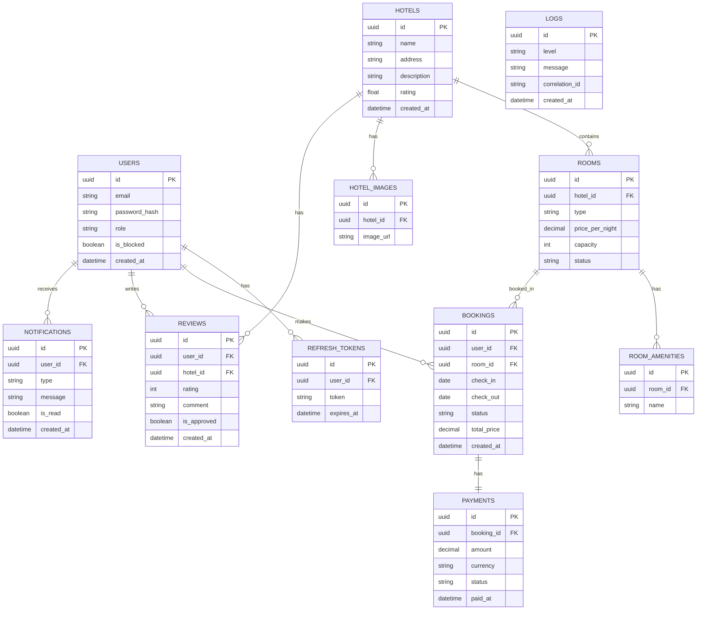

# ✅ Обязательный функционал (Required Features)

В данном разделе описан ключевой функционал, необходимый для полноценной работы системы бронирования отелей в реальных условиях эксплуатации.

---

## 👤 1. Аутентификация и авторизация

### Обязательно

- Регистрация пользователей по email
- Авторизация и выход из системы
- JWT Access Token
- Refresh Token
- Хэширование паролей
- Ролевая модель доступа:
    - User — клиент
    - Admin — администратор

### Дополнительно

- Восстановление пароля
- Двухфакторная аутентификация (2FA)

---

## 🏨 2. Управление отелями

### Обязательно

- Создание отеля (только для Admin)
- Обновление информации об отеле
- Удаление отеля
- Получение списка отелей
- Получение детальной информации

### Основные поля

- Название
- Адрес
- Описание
- Фотографии
- Рейтинг

---

## 🛏 3. Управление номерами

### Обязательно

- Создание, обновление и удаление номеров
- Привязка номеров к отелям
- Управление статусом номера

### Статусы

- Available — доступен
- Booked — забронирован
- Maintenance — на обслуживании

### Основные поля

- Тип
- Цена за ночь
- Вместимость
- Удобства

---

## 🔍 4. Поиск и фильтрация

### Обязательно

- Поиск по диапазону дат
- Проверка доступности номеров
- Фильтрация по цене
- Фильтрация по количеству гостей
- Фильтрация по типу номера

### Дополнительно

- Сортировка результатов
- Пагинация

---

## 📅 5. Управление бронированием

### Обязательно

- Проверка доступности номера перед бронированием
- Создание бронирования
- Подтверждение бронирования
- Отмена бронирования
- Изменение дат проживания
- Просмотр истории бронирований

### Статусы бронирования

- Pending
- Confirmed
- Paid
- Canceled
- Completed
- 
---

## 💳 6. Платежи

### Обязательно

- Привязка платежа к бронированию
- Отслеживание статуса оплаты
- Поддержка тестового (mock) платёжного сервиса
- Обработка уведомлений о статусе платежа

### Основные поля

- Сумма
- Валюта
- Статус
- Дата платежа

---

## ⭐ 7. Отзывы и рейтинги

### Обязательно

- Добавление отзывов пользователями
- Оценка от 1 до 5
- Привязка отзывов к отелям
- Модерация отзывов администратором

---

## 🔔 8. Уведомления

### Обязательно

- Email-уведомления (mock-реализация)
- Внутренние системные уведомления

### События

- Создание бронирования
- Подтверждение бронирования
- Отмена бронирования
- Успешная оплата

---

## 📊 9. Администрирование

### Обязательно

- Просмотр статистики бронирований
- Отчеты по доходам
- Анализ загруженности отелей
- Управление пользователями
- Блокировка аккаунтов

---

## 📈 10. Логирование и мониторинг

### Обязательно

- Логирование ошибок
- Логирование HTTP-запросов
- Логирование бизнес-событий
- Поддержка Correlation ID

### Дополнительно

- Метрики производительности
- Health Checks

---

## 🧪 11. Тестирование

### Обязательно

- Unit-тесты бизнес-логики
- Integration-тесты API
- Тесты взаимодействия с БД

Минимальное покрытие тестами: **60%+**

---

## 🔐 12. Безопасность

### Обязательно

- HTTPS
- Ограничение количества запросов (Rate Limiting)
- Валидация входных данных
- Защита от SQL-инъекций
- Настройка CORS
- Защита от XSS и CSRF

